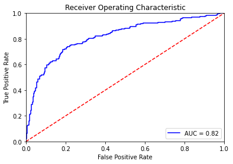

# Stock market prediction using technical data

The notebook in this repo has all the EDA and logistic regression code that uses technical data of days "t" and "t-1" to help pick stocks that will give positive returns on day "t+1"

The ROC curves on train data

